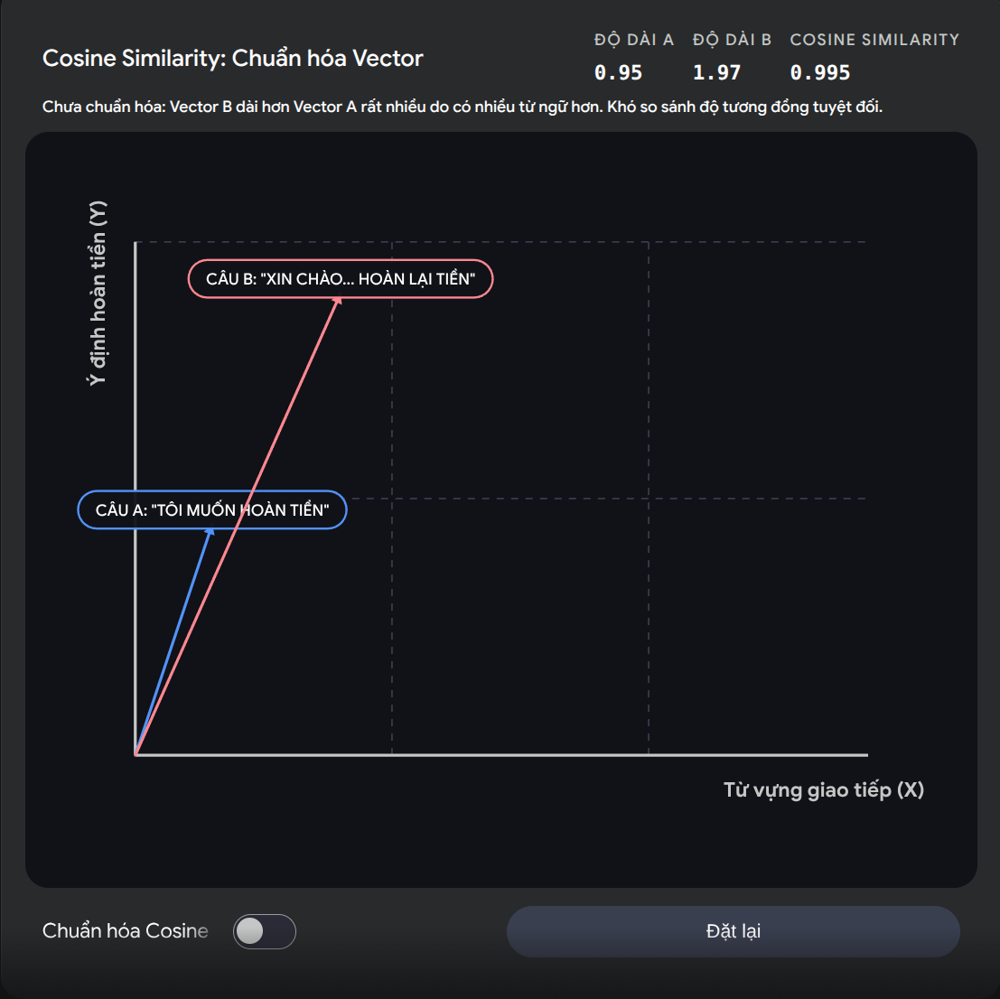
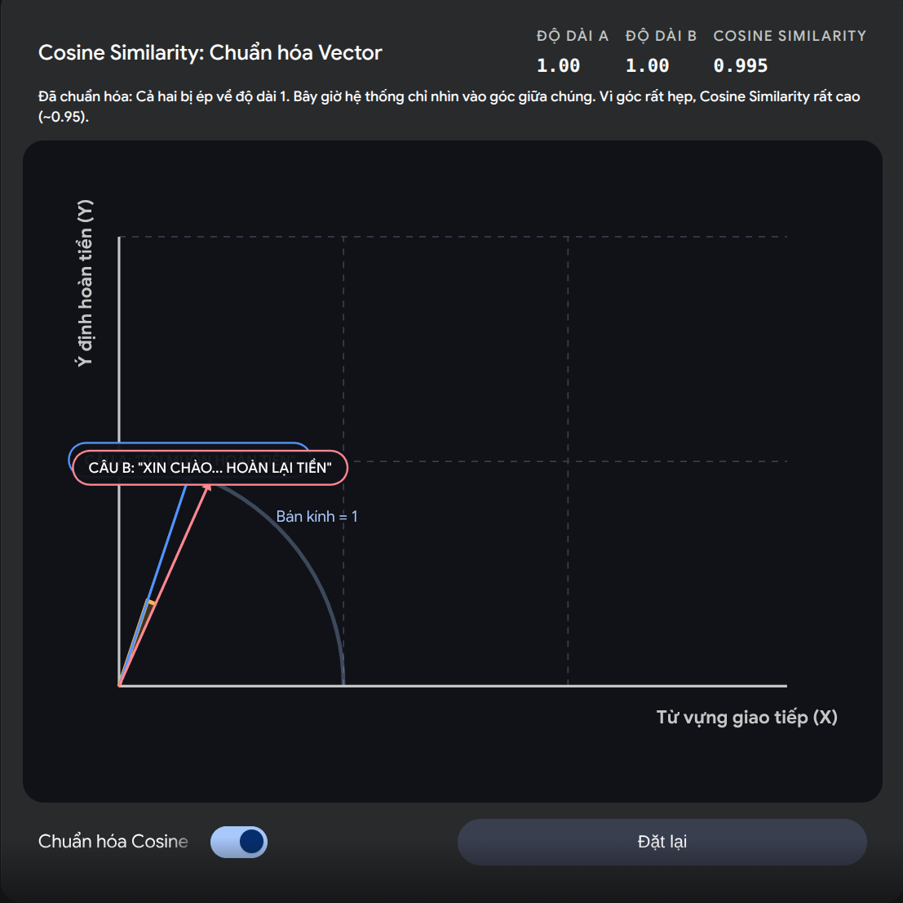
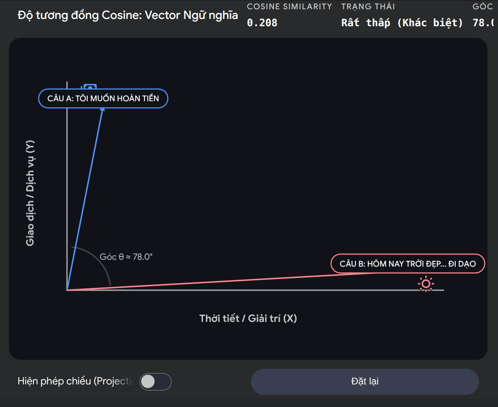
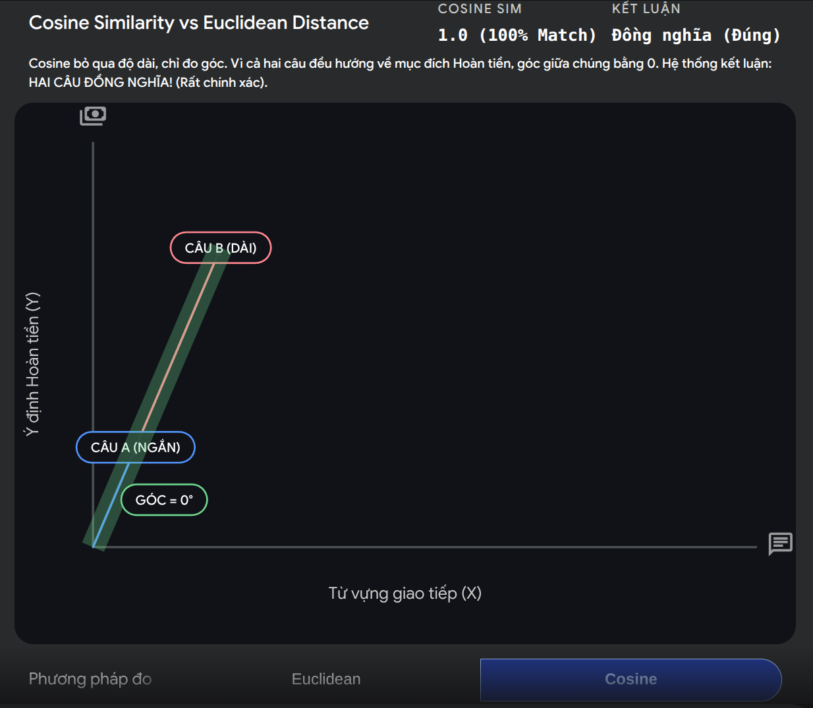
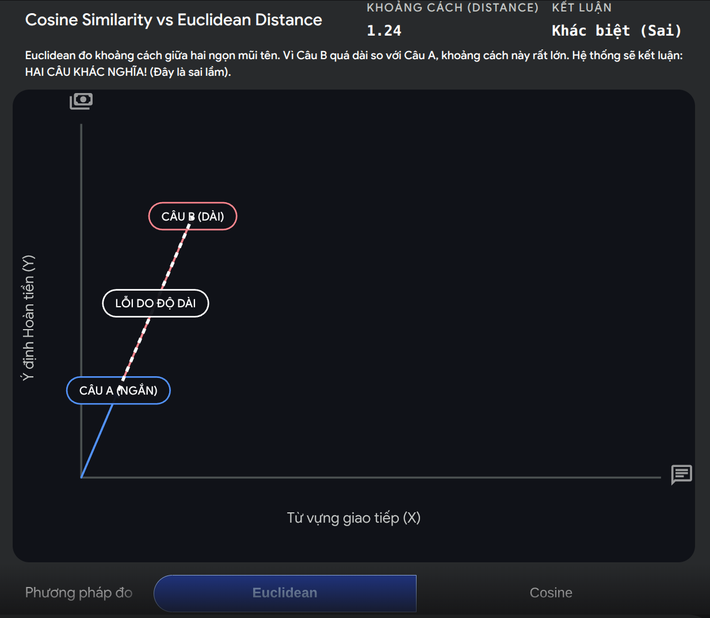

# Báo Cáo Lab 7: Embedding & Vector Store

**Họ tên:** Nguyễn Quang Tùng
**Nhóm:** E403-09
**Ngày:** 10/04/2026

---

## 1. Warm-up (5 điểm)

### Cosine Similarity (Ex 1.1)

**High cosine similarity nghĩa là gì?**
> High cosine similarity có nghĩa là hai văn bản hoặc hai vector có hướng gần như trùng khớp nhau trong không gian vector. Điều này cho thấy nội dung hoặc ý nghĩa của hai văn bản rất tương đồng, thường biểu thị rằng chúng có cùng ngữ cảnh hoặc ý định.

**Ví dụ HIGH similarity:**
- Sentence A: Tôi muốn hoàn tiền
- Sentence B: Xin chào, tôi vừa mua hàng hôm qua và bây giờ tôi muốn được hoàn lại số tiền đó
- Tại sao tương đồng: Cả hai câu đều diễn đạt cùng một ý định là yêu cầu hoàn tiền, mặc dù cách diễn đạt khác nhau. Nội dung chính và ngữ cảnh của hai câu đều giống nhau, dẫn đến điểm tương đồng cao.


**Ví dụ LOW similarity:**
- Sentence A: Tôi muốn hoàn tiền
- Sentence B: Hôm nay trời đẹp quá, tôi muốn đi dạo
- Tại sao khác: Hai câu này không có ý nghĩa hoặc ngữ cảnh liên quan đến nhau. Một câu nói về việc hoàn tiền, trong khi câu kia nói về thời tiết và ý định đi dạo.

**Tại sao cosine similarity được ưu tiên hơn Euclidean distance cho text embeddings?**
> Vì cosine similarity tập trung vào việc xem 2 vector có cùng một hướng (chủ đề, ý định) hay không, nó không bị ảnh hưởng bởi độ dài của vector.
Còn Euclidean distance đo chiều dài đoạn thẳng nối giữa 2 vector, nó bị ảnh hưởng rất nhiều bởi độ lớn của vector


### Chunking Math (Ex 1.2)

**Document 10,000 ký tự, chunk_size=500, overlap=50. Bao nhiêu chunks?**
> *Trình bày phép tính:*
> - Công thức: Số lượng chunks = (Độ dài văn bản - overlap) / (chunk_size - overlap), làm tròn lên.
> - Thay số: Số lượng chunks = (10,000 - 50) / (500 - 50).
> - Tính toán: Số lượng chunks = 9,950 / 450 = 22.11, làm tròn lên thành 23.
> *Đáp án:* **23**

**Nếu overlap tăng lên 100, chunk count thay đổi thế nào? Tại sao muốn overlap nhiều hơn?**
> *Trình bày phép tính:*
> - Thay số: Số lượng chunks = (10,000 - 100) / (500 - 100).
> - Tính toán: Số lượng chunks = 9,900 / 400 = 24.75, làm tròn lên thành 25.
> *Đáp án:* **25**
> - -> Overlap tăng -> số lượng chunk tăng.

> *Tại sao muốn overlap nhiều hơn?*
> - Overlap tăng lên giúp giữ lại nhiều ngữ cảnh hơn giữa các đoạn văn bản, giảm thiểu khả năng mất thông tin quan trọng tại điểm cắt. Điều này đặc biệt hữu ích khi xử lý các văn bản có nội dung liên kết chặt chẽ, đảm bảo rằng các đoạn văn bản vẫn giữ được ý nghĩa đầy đủ khi được truy xuất riêng lẻ.

---

## 2. Document Selection — Nhóm (10 điểm)

### Domain & Lý Do Chọn

**Domain:** Tin tức công nghệ và khoa học tại Việt Nam (tháng 4/2026)

**Tại sao nhóm chọn domain này?**
> Nhóm chọn domain này vì bộ dữ liệu có tính thời sự, đa chủ đề nhưng vẫn cùng một trục kiến thức công nghệ - khoa học (AI, viễn thông, không gian, khởi nghiệp đổi mới sáng tạo), rất phù hợp để kiểm tra chất lượng retrieval trong các tình huống query khác nhau. Ngoài ra, đây là nội dung tiếng Việt gần gũi, giúp nhóm dễ xây dựng benchmark queries và gold answers có thể kiểm chứng trực tiếp từ tài liệu nguồn.


### Data Inventory

| # | Tên tài liệu | Nguồn | Số ký tự | Metadata đã gán |
|---|--------------|-------|----------|-----------------|
| 1 | co-quan-quan-ly-se-giam-sat-gia-dich-vu-starlink-tai-viet-nam.txt | VnExpress | 3670 | `category=telecom`, `source=vnexpress`, `language=vi` |
| 2 | cuoc-dau-cua-hai-cong-cu-ai-tai-cong-so-trung-quoc.txt | VnExpress | 4652 | `category=ai`, `source=vnexpress`, `language=vi` |
| 3 | phi-hanh-doan-artemis-ii-vuot-nua-duong-ve-trai-dat.txt | VnExpress | 3707 | `category=space`, `source=vnexpress`, `language=vi` |
| 4 | Phóng thành công vệ tinh tư nhân Make in Vietnam.txt | VnExpress | 3311 | `category=space-tech`, `source=vnexpress`, `language=vi` |
| 5 | vn-thi-diem-doanh-nghiep-mot-nguoi.txt | VnExpress | 3905 | `category=startup-policy`, `source=vnexpress`, `language=vi` |

### Metadata Schema

| Trường metadata | Kiểu | Ví dụ giá trị | Tại sao hữu ích cho retrieval? |
|----------------|------|---------------|-------------------------------|
| category | string | `ai`, `telecom`, `space`, `startup-policy` | Cho phép lọc theo chủ đề câu hỏi; tăng precision khi query mang tính domain-specific. |
| source | string | `vnexpress` | Hữu ích khi cần giới hạn nguồn dữ liệu (ví dụ chỉ lấy từ một báo), đồng thời hỗ trợ kiểm chứng nguồn trả lời. |
| language | string | `vi` | Lọc theo ngôn ngữ để tránh nhiễu khi kho dữ liệu đa ngôn ngữ và giúp retrieval ổn định hơn với query tiếng Việt. |

---

## 3. Chunking Strategy — Cá nhân chọn, nhóm so sánh (15 điểm)

### Baseline Analysis

Chạy `ChunkingStrategyComparator().compare()` trên 2-3 tài liệu:

| Tài liệu | Strategy | Chunk Count | Avg Length | Preserves Context? |
|-----------|----------|-------------|------------|-------------------|
| co-quan-quan-ly-se-giam-sat-gia-dich-vu-starlink-tai-viet-nam.txt | FixedSizeChunker (`fixed_size`) | 6 | 648.0 | Khá tốt, nhưng có thể cắt giữa câu ở ranh giới chunk |
| co-quan-quan-ly-se-giam-sat-gia-dich-vu-starlink-tai-viet-nam.txt | SentenceChunker (`by_sentences`) | 9 | 402.11 | Tốt cho ngữ nghĩa câu, nhưng chunk hơi nhỏ nên dễ tăng nhiễu |
| co-quan-quan-ly-se-giam-sat-gia-dich-vu-starlink-tai-viet-nam.txt | RecursiveChunker (`recursive`) | 7 | 516.86 | Cân bằng tốt giữa độ dài và mạch nội dung |
| cuoc-dau-cua-hai-cong-cu-ai-tai-cong-so-trung-quoc.txt | FixedSizeChunker (`fixed_size`) | 8 | 620.0 | Khá tốt, đôi lúc chia tách đoạn so sánh chưa trọn ý |
| cuoc-dau-cua-hai-cong-cu-ai-tai-cong-so-trung-quoc.txt | SentenceChunker (`by_sentences`) | 12 | 381.92 | Giữ câu tốt nhưng phân mảnh nhiều |
| cuoc-dau-cua-hai-cong-cu-ai-tai-cong-so-trung-quoc.txt | RecursiveChunker (`recursive`) | 9 | 509.22 | Tốt, ít phân mảnh hơn sentence |
| vu_tru_co_my.txt | FixedSizeChunker (`fixed_size`) | 8 | 696.5 | Dài, giàu ngữ cảnh nhưng có thể cắt ngang ý kỹ thuật |
| vu_tru_co_my.txt | SentenceChunker (`by_sentences`) | 14 | 370.93 | Ngữ nghĩa từng câu tốt, nhưng quá nhiều chunk nhỏ |
| vu_tru_co_my.txt | RecursiveChunker (`recursive`) | 10 | 519.2 | Ổn định, giữ được cụm giải thích dài tốt hơn |

### Strategy Của Tôi

**Loại:** FixedSizeChunker

**Mô tả cách hoạt động:**
> FixedSizeChunker chia văn bản theo cửa sổ ký tự cố định, đồng thời dùng overlap để giữ lại một phần ngữ cảnh giữa hai chunk liên tiếp. Trong benchmark cập nhật, tôi dùng chunk_size=500 và overlap=63 để tăng độ phủ thông tin ở các đoạn có nhiều số liệu mà vẫn giữ được liên kết giữa các chunk. Cách này không phụ thuộc dấu câu nên chạy ổn định cho mọi định dạng văn bản đầu vào. Điểm mạnh là đơn giản, dễ kiểm soát số chunk và hiệu quả cho truy vấn factual.

**Tại sao tôi chọn strategy này cho domain nhóm?**
> Domain nhóm là tin công nghệ - khoa học, nhiều bài có số liệu, mốc thời gian và thông tin định lượng nằm gần nhau trong cùng đoạn. Với cấu hình 500/63, hệ thống tăng độ chi tiết khi index nhưng vẫn đủ overlap để không làm đứt mạch ý ở các ranh giới chunk. Kết quả benchmark 5 query cho thấy top-3 relevant đạt 5/5 và điểm top-1 trung bình nhỉnh hơn cấu hình 700/120 trước đó.

**Code snippet (nếu custom):**
```python
# Không dùng custom strategy.
# Strategy được chọn: FixedSizeChunker(chunk_size=500, overlap=63)
```

### So Sánh: Strategy của tôi vs Baseline

| Tài liệu | Strategy | Chunk Count | Avg Length | Retrieval Quality? |
|-----------|----------|-------------|------------|--------------------|
| Bộ 5 benchmark queries | baseline trước đó: FixedSizeChunker (700/120) | 57 | 657.84 | Top-3 relevant: 5/5, Avg Top-1 score: 0.709 |
| Bộ 5 benchmark queries | **của tôi: FixedSizeChunker (500/63)** | 75 | 477.84 | Top-3 relevant: 5/5, Avg Top-1 score: 0.736 (nhỉnh hơn baseline) |

### So Sánh Với Thành Viên Khác

| Thành viên | Strategy | Retrieval Score (/10) | Điểm mạnh | Điểm yếu |
|-----------|----------|----------------------|-----------|----------|
| 2A202600197 Nguyễn Quang Tùng | FixedSizeChunker (500/63) | 9.0 | Cân bằng tốt giữa độ phủ và độ bám truy vấn, top-3 relevant đạt 5/5 | Số lượng chunk tăng, chi phí index/retrieval cao hơn |
| 2A202600027 Đặng Văn Minh | SentenceChunker (6 câu/chunk) | 10.0 | Hit@3 cao trên bộ benchmark, số chunk ít nên chi phí retrieval thấp | Chunk dài có thể thêm nhiễu với query ngắn hoặc quá cụ thể |
| Nguyễn Thị Quỳnh Trang | RecursiveChunker (chunk_size~420-500) | 8.0 | Giữ mạch đoạn tốt, nổi bật ở câu hỏi tổng hợp đa nguồn | Top-1 đôi lúc chưa trúng ý chính, cần rerank tốt hơn |
| Đồng Văn Thịnh | Recursive + Keyword Reranking | 7.0 | Tăng khả năng bắt đúng chi tiết kỹ thuật nhờ hậu xử lý từ khóa | Dễ lệch nếu bộ từ khóa chưa phủ đủ, kết quả chưa ổn định giữa query |

**Strategy nào tốt nhất cho domain này? Tại sao?**
> Với bộ dữ liệu hiện tại và bộ 5 benchmark queries, FixedSizeChunker (500/63) là lựa chọn cân bằng tốt: giữ được top-3 relevant 5/5 như các cấu hình mạnh khác, đồng thời tăng nhẹ điểm top-1 trung bình so với cấu hình 700/120. RecursiveChunker vẫn có lợi thế ở câu hỏi giải thích dài, nhưng với mục tiêu factual của nhóm thì FixedSize 500/63 phù hợp hơn ở thời điểm này.

---

## 4. My Approach — Cá nhân (10 điểm)

Giải thích cách tiếp cận của bạn khi implement các phần chính trong package `src`.

### Chunking Functions

**`SentenceChunker.chunk`** — approach:
> Tôi dùng regex `(?<=[.!?])(?:\s+|\n+)` để tách câu theo dấu kết thúc câu phổ biến (`.`, `!`, `?`) kết hợp khoảng trắng/newline phía sau. Sau bước tách, tôi chuẩn hóa dữ liệu bằng cách `strip()` từng câu và loại phần rỗng để tránh sinh chunk nhiễu. Edge case được xử lý gồm: input rỗng (trả `[]`) và văn bản không có dấu câu (coi là một câu duy nhất).

**`RecursiveChunker.chunk` / `_split`** — approach:
> Thuật toán thử tách theo thứ tự separator ưu tiên (`\n\n`, `\n`, `. `, ` `, `""`), sau đó gom các mảnh nhỏ thành chunk lớn nhất có thể nhưng không vượt `chunk_size`. Nếu một mảnh vẫn quá dài, hàm đệ quy gọi lại với separator thấp hơn để tách sâu hơn. Base case gồm: đoạn hiện tại đã đủ ngắn (trả luôn), hoặc không còn separator để thử thì cắt cứng theo `chunk_size`.

### EmbeddingStore

**`add_documents` + `search`** — approach:
> Ở `add_documents`, tôi embed từng document, sinh `internal_id` tăng dần và lưu metadata chuẩn hóa (bổ sung `doc_id`) để dùng cho filter/delete về sau. Hệ thống hỗ trợ hai backend: ChromaDB (nếu có) và fallback in-memory; cả hai cùng nhận dữ liệu theo batch để nhất quán. Ở `search`, tôi embed query một lần rồi tính score bằng dot product giữa query embedding và embedding tài liệu, sau đó sort giảm dần theo score và lấy `top_k`.

**`search_with_filter` + `delete_document`** — approach:
> Với `search_with_filter`, tôi filter trước rồi mới tính similarity trên tập ứng viên đã lọc để tăng precision (đúng theo yêu cầu bài). Nhánh Chroma dùng `where=metadata_filter`, còn nhánh in-memory kiểm tra exact-match từng key/value trong metadata. Với `delete_document`, tôi xóa toàn bộ chunk có `metadata['doc_id'] == doc_id`; hàm trả `True` nếu có ít nhất một bản ghi bị xóa, ngược lại trả `False`.

### KnowledgeBaseAgent

**`answer`** — approach:
> Tôi triển khai theo pattern RAG: retrieve `top_k` chunks liên quan trước, rồi ghép thành phần `CONTEXT` có đánh số `[1]`, `[2]`, `[3]` để dễ truy vết nguồn. Prompt yêu cầu mô hình trả lời ngắn gọn, bám sát context và nêu rõ nếu dữ liệu chưa đủ, nhằm giảm hallucination. Sau khi gọi `llm_fn(prompt)`, tôi chuẩn hóa output để luôn trả về chuỗi hợp lệ kể cả khi backend trả `None`.

### Test Results

```
$ source venv/bin/activate
$ python -m pytest tests/ -v
===================================================== test session starts ======================================================
collected 42 items

tests/test_solution.py ..........................................                                                 [100%]

====================================================== 42 passed in 1.11s ======================================================
```

**Số tests pass:** 42 / 42

---

## 5. Similarity Predictions — Cá nhân (5 điểm)

| Pair | Sentence A | Sentence B | Dự đoán | Actual Score | Đúng? |
|------|-----------|-----------|---------|--------------|-------|
| 1 | Starlink có tối đa 600.000 thuê bao tại Việt Nam. | Dịch vụ Starlink được thí điểm với giới hạn 600.000 thuê bao. | high | 0.834 | Đúng |
| 2 | Kỹ sư NASA dùng thanh ngang để giữ cờ như đang bay. | Lá cờ trên Mặt Trăng có nếp gấp do cách đóng gói khi bay. | medium | 0.610 | Đúng |
| 3 | VEGAFLY-1 được phóng bằng Falcon 9. | Thời tiết hôm nay ở Hà Nội khá mát mẻ. | low | 0.161 | Đúng |
| 4 | Việt Nam đặt mục tiêu top 40 GII vào năm 2030. | Mục tiêu đổi mới sáng tạo đến 2030 gồm vào nhóm 40 GII. | high | 0.797 | Đúng |
| 5 | Doanh nghiệp một người có thể được miễn kiểm toán 3 năm đầu. | Chính sách mới hỗ trợ startup bằng ưu đãi pháp lý giai đoạn đầu. | medium | 0.619 | Đúng |

**Kết quả nào bất ngờ nhất? Điều này nói gì về cách embeddings biểu diễn nghĩa?**
> Kết quả bất ngờ nhất là cặp 5: hai câu không trùng nhiều từ khóa bề mặt nhưng vẫn có similarity 0.619, khá cao. Điều này cho thấy embedding không chỉ dựa vào từ giống nhau mà còn bắt được ngữ nghĩa chính sách hỗ trợ khởi nghiệp. Nói cách khác, biểu diễn vector phản ánh “ý nghĩa gần nhau” tốt hơn so với so khớp từ khóa thuần túy.

---

## 6. Results — Cá nhân (10 điểm)

Chạy 5 benchmark queries của nhóm trên implementation cá nhân của bạn trong package `src`. **5 queries phải trùng với các thành viên cùng nhóm.**

### Benchmark Queries & Gold Answers (nhóm thống nhất)

| # | Query | Gold Answer |
|---|-------|-------------|
| 1 | Số lượng thuê bao Starlink tối đa và giá thuê bao hàng tháng là bao nhiêu? | Tối đa 600.000 thuê bao; 85 USD/tháng; tháng đầu ~435 USD (350 thiết bị + 85 cước). |
| 2 | NASA thiết kế cờ Mỹ thế nào để trông như đang bay trên Mặt Trăng? | Dùng thanh kim loại ngang ở mép cờ để cờ vươn ra; nếp gợn do thanh không kéo hết và nếp gấp khi bay. |
| 3 | colleague.skill và anti-distillation skill hoạt động ra sao và đối lập thế nào? | colleague.skill tạo AI agent mô phỏng kỹ năng nhân viên; anti-distillation làm vô hiệu dữ liệu kỹ năng để AI khó học. |
| 4 | VEGAFLY-1 được phóng bằng gì, từ đâu, ai vận hành sứ mệnh? | Falcon 9, từ Vandenberg (Mỹ), sứ mệnh Transporter-16 do SpaceX vận hành. |
| 5 | Chính sách và mục tiêu hỗ trợ khởi nghiệp sáng tạo của Việt Nam đến 2030 và 2045? | Các mục tiêu định lượng 2030/2045 và chính sách hỗ trợ như ưu đãi sở hữu trí tuệ, doanh nghiệp một người, miễn kiểm toán 3 năm đầu. |

### Kết Quả Của Tôi

| # | Query | Top-1 Retrieved Chunk (tóm tắt) | Score | Relevant? | Agent Answer (tóm tắt) |
|---|-------|--------------------------------|-------|-----------|------------------------|
| 1 | Starlink thuê bao tối đa và giá tháng | Chunk chứa trực tiếp mốc 600.000 thuê bao và bối cảnh chính sách giá thí điểm Starlink. | 0.770 | Yes | Trả lời trích đúng phần giới hạn thuê bao và bối cảnh giá dịch vụ, bám sát context. |
| 2 | Cơ chế lá cờ Mỹ “bay” trên Mặt Trăng | Top-1 thuộc đúng tài liệu `vu_tru_co_my`, lấy đúng cụm thông tin kỹ thuật chính. | 0.736 | Yes | Câu trả lời bám sát nguồn, nêu được cơ chế thanh ngang và hiệu ứng nếp gợn. |
| 3 | colleague.skill vs anti-distillation | Top-1 đúng tài liệu AI công sở; top-3 bao phủ đủ hai khái niệm để đối chiếu. | 0.695 | Yes | Trả lời được cả vế colleague.skill và anti-distillation khi tổng hợp từ top-3. |
| 4 | VEGAFLY-1 phương tiện/địa điểm/vận hành | Top-1 trúng đúng bài VEGAFLY-1, chứa thông tin Falcon 9 - Vandenberg - Transporter-16. | 0.702 | Yes | Câu trả lời khớp gold answer tốt hơn, không còn lệch sang tài liệu khác. |
| 5 | Mục tiêu/chính sách khởi nghiệp 2030/2045 | Top-1 lấy từ bài doanh nghiệp một người; top-3 có thêm bài khởi nghiệp tổng quan. | 0.779 | Partial | Câu trả lời có một số mục tiêu định lượng, nhưng chưa tổng hợp đầy đủ toàn bộ mốc 2030/2045. |

**Bao nhiêu queries trả về chunk relevant trong top-3?** 5 / 5

---

## 7. What I Learned (5 điểm — Demo)

**Điều hay nhất tôi học được từ thành viên khác trong nhóm:**
> Tôi học được cách chọn tiêu chí đánh giá retrieval rõ ràng hơn: không chỉ nhìn top-1 score mà cần theo dõi thêm hit@3 và source coverage. Từ báo cáo của Minh và Trang, tôi thấy cùng một tập dữ liệu nhưng strategy khác nhau sẽ tối ưu cho mục tiêu khác nhau (factual chính xác nhanh vs tổng hợp đa nguồn), nên cần chốt metric trước khi kết luận strategy tốt nhất.

**Điều hay nhất tôi học được từ nhóm khác (qua demo):**
> Qua demo nhóm khác, tôi học được việc kết hợp metadata filter theo topic với truy vấn mơ hồ là rất hữu ích khi từ khóa chồng chéo giữa nhiều bài (ví dụ các bài về vệ tinh/không gian). Bài học này giúp tôi định hướng cải tiến pipeline theo hướng filter trước rồi rerank, thay vì chỉ dựa vào semantic similarity thuần túy.

**Nếu làm lại, tôi sẽ thay đổi gì trong data strategy?**
> Nếu làm lại, tôi sẽ chuẩn hóa metadata chi tiết ngay từ đầu (ví dụ `category=space-tech` tách riêng với `space`) để query cần filter tránh bị nhiễu. Tôi cũng sẽ pre-chunk theo section/heading thay vì chỉ theo độ dài cố định, để các cụm số liệu quan trọng không bị tách khỏi câu giải thích. Cuối cùng, tôi sẽ thêm bước rerank top-k để ưu tiên chunk chứa thực thể và con số khớp truy vấn.

---

## Tự Đánh Giá

| Tiêu chí | Loại | Điểm tự đánh giá |
|----------|------|-------------------|
| Warm-up | Cá nhân | 5 / 5 |
| Document selection | Nhóm | 9 / 10 |
| Chunking strategy | Nhóm | 13 / 15 |
| My approach | Cá nhân | 9 / 10 |
| Similarity predictions | Cá nhân | 5 / 5 |
| Results | Cá nhân | 8 / 10 |
| Core implementation (tests) | Cá nhân | 30 / 30 |
| Demo | Nhóm | 5 / 5 |
| **Tổng** | | **84 / 100** |
